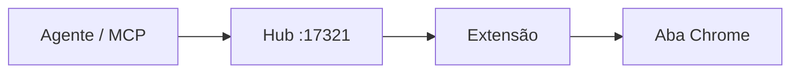

# paiva

Frontend. Site de estúdio e loja — rápido, escuro, Zap no lugar certo.

[paiva.lat](https://www.paiva.lat) · [código](https://github.com/paivaxqz/paiva-portfolio)

 

---

 

# Clique Já

**Automação de browser rápida** — extensão Chrome MV3 + hub local + MCP.

Clique, fill e snapshot na aba real. Sessão que você já usa. Sem subir Chromium do zero pra cada gesto.

**[Abrir repositório →](https://github.com/paivaxqz/cliqueja)**

